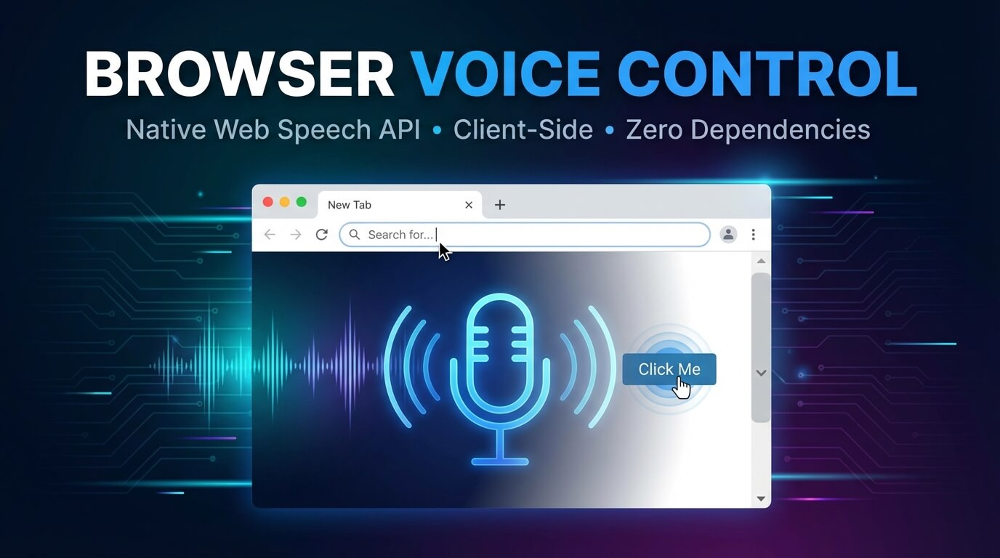

# 🎙 Browser Voice Control — Agent Skill

<p align="center">
  
</p>

> Give any AI coding agent a voice. This skill teaches your agent how to build fully hands-free, voice-driven browser interfaces using the **native Web Speech API** — zero dependencies, zero API keys, entirely client-side.

This is an [Agent Skills](https://agentskills.io) package compatible with Claude Code, Gemini CLI, Google Antigravity, Cursor, and any other tool that follows the open `SKILL.md` standard.

---

## What it does

When you ask your agent to "add voice control", "make this voice-activated", or "build a hands-free interface", this skill loads and provides the agent with:

- A complete **command registry pattern** for mapping speech → DOM actions
- A ready-to-use **HTML/JS boilerplate** with status UI and error handling
- All **browser compatibility rules**, permission requirements, and UX constraints
- Patterns for scrolling, tab control, search, form fill, click-by-label, and text-to-speech feedback

### Example prompts that trigger this skill

```
"Add voice control to this page"
"Make the dashboard hands-free"
"Build a voice-activated search"
"Let users scroll with voice commands"
"Create a voice command interface"
"Make it so I can click buttons by saying their name"
```

---

## Skill structure

```
browser-voice-control/
├── SKILL.md                          ← Main instructions (required)
└── references/
    ├── speech-recognition-api.md     ← Full SpeechRecognition API reference
    └── locales.md                    ← BCP 47 language codes
```

---

## Voice commands supported

| Voice command | Action |
|---|---|
| "Open a new tab" | `window.open('about:blank', '_blank')` |
| "Close this tab" | `window.close()` |
| "Scroll down / up" | `window.scrollBy()` |
| "Go to top / bottom" | `window.scrollTo()` |
| "Search for [query]" | Focuses search input or opens Google |
| "Click [element name]" | Fuzzy-matches and clicks any button/link |
| "Fill [field] with [value]" | Targets input by name/placeholder and fills it |
| "Go back / forward" | `history.back()` / `history.forward()` |
| "Refresh the page" | `location.reload()` |
| "Read the page" | `SpeechSynthesis` reads visible text aloud |
| "Stop listening" | Stops the recognition session |

---

## Browser compatibility

| Browser | Support | Notes |
|---|---|---|
| **Chrome 33+** | ✅ Full | Recommended |
| **Edge 79+** | ✅ Full | Chromium-based |
| **Safari 14.1+** | ⚠️ Partial | No `continuous` mode; single-shot only |
| **Firefox** | ❌ Not supported | Web Speech API not implemented |
| **Mobile Chrome** | ✅ Full | Works on Android |
| **Mobile Safari** | ⚠️ Limited | iOS 14.5+; requires user gesture |
| **Samsung Internet** | ✅ Partial | Based on Chromium |
| **Opera** | ✅ Full | Chromium-based |

> **Note:** The skill always generates a fallback message when `SpeechRecognition` is undefined, so unsupported browsers degrade gracefully.

### HTTPS requirement

`SpeechRecognition` is blocked on plain `http://` pages in all browsers. The only exception is `localhost` during local development.

---

## Language support (locales)

Set `recognition.lang` to any BCP 47 code. Leaving it empty (`""`) defaults to the browser's UI language.

| Code | Language |
|---|---|
| `en-US` | English (United States) |
| `en-GB` | English (United Kingdom) |
| `es-ES` | Spanish (Spain) |
| `es-MX` | Spanish (Mexico) |
| `fr-FR` | French (France) |
| `de-DE` | German (Germany) |
| `it-IT` | Italian (Italy) |
| `pt-BR` | Portuguese (Brazil) |
| `ja-JP` | Japanese |
| `ko-KR` | Korean |
| `zh-CN` | Chinese (Simplified) |
| `zh-TW` | Chinese (Traditional) |
| `ar-SA` | Arabic (Saudi Arabia) |
| `hi-IN` | Hindi (India) |
| `ru-RU` | Russian |
| `nl-NL` | Dutch |
| `pl-PL` | Polish |
| `sv-SE` | Swedish |
| `tr-TR` | Turkish |

See [`references/locales.md`](browser-voice-control/references/locales.md) for the full list.

---

## Installation

### Claude.ai (web / desktop)

1. Download the `.skill` file from [Releases](../../releases) or clone this repo and zip the folder.
2. In Claude.ai, go to **Customize → Skills**.
3. Click the **+** button → **Upload a skill**.
4. Upload the `.skill` zip file.
5. Toggle the skill **on** — it will now activate automatically when relevant.

> Skills require **Code execution** to be enabled. Go to **Settings → Capabilities** and turn it on if you haven't already. Available on Pro, Max, Team, and Enterprise plans.

---

### Claude Code (CLI)

Skills live in `~/.claude/skills/` (global, all projects) or `.claude/skills/` (project-local).

**Option A — clone directly into your skills folder:**
```bash
git clone https://github.com/YOUR_USERNAME/browser-voice-control \
  ~/.claude/skills/browser-voice-control
```

**Option B — copy a single skill folder manually:**
```bash
mkdir -p ~/.claude/skills/browser-voice-control
cp -r /path/to/browser-voice-control/. ~/.claude/skills/browser-voice-control/
```

**Option C — use the Vercel skills CLI:**
```bash
npx agent-skills-cli add YOUR_USERNAME/browser-voice-control
```

After installation, Claude Code discovers the skill automatically. You can also invoke it directly:
```
/browser-voice-control
```

---

### Gemini CLI

Gemini CLI follows the same Agent Skills open standard. Place the skill in `~/.gemini/skills/` for global access, or `.gemini/skills/` inside your project.

```bash
# Global install (available in all projects)
mkdir -p ~/.gemini/skills/browser-voice-control
cp -r /path/to/browser-voice-control/. ~/.gemini/skills/browser-voice-control/

# Or project-local
mkdir -p .gemini/skills/browser-voice-control
cp -r /path/to/browser-voice-control/. .gemini/skills/browser-voice-control/
```

Gemini CLI will auto-detect the skill from the `SKILL.md` frontmatter. You can also invoke it directly in the chat:
```
/browser-voice-control
```

> The skill works with all models available in Gemini CLI (Gemini 3 Pro, Gemini 3 Flash, etc.).

---

### Google Antigravity

[Google Antigravity](https://antigravity.google) is Google's agentic IDE. It supports the same `SKILL.md` format natively with two install scopes:

**Workspace scope** (project-specific — recommended for team projects):
```bash
mkdir -p .agent/skills/browser-voice-control
cp -r /path/to/browser-voice-control/. .agent/skills/browser-voice-control/
```

**Global scope** (available across all your Antigravity projects):
```bash
mkdir -p ~/.gemini/antigravity/skills/browser-voice-control
cp -r /path/to/browser-voice-control/. ~/.gemini/antigravity/skills/browser-voice-control/
```

After copying, **restart your agent session** so Antigravity re-scans the skills directory. The skill will then appear in the agent's toolkit and auto-activate when you ask for voice control features.

> Unlike Rules (which are always on) and Workflows (which you trigger with `/`), Skills in Antigravity are **agent-triggered** — the model loads them automatically when your request matches the skill description.

---

### Cursor

Cursor 2.3+ supports Agent Skills natively via `.cursor/skills/`.

**Project-local install:**
```bash
mkdir -p .cursor/skills/browser-voice-control
cp -r /path/to/browser-voice-control/. .cursor/skills/browser-voice-control/
```

**Global install** (available in all your Cursor projects via MCP — see [cursor-skills](https://github.com/chrisboden/cursor-skills) for setup):
```bash
mkdir -p ~/.cursor/skills/browser-voice-control
cp -r /path/to/browser-voice-control/. ~/.cursor/skills/browser-voice-control/
```

Or use the Cursor command palette:

1. Open `Cmd+Shift+P` → **Cursor Rules: Add Skill**
2. Point it at your local copy of this folder.

Cursor loads the skill dynamically when the agent determines it is relevant. You can also trigger it explicitly in the agent panel:
```
/browser-voice-control
```

---

## Permissions & UX notes

- **User gesture required** — `recognition.start()` must be triggered by a click or keydown event. Autostart on page load is blocked by all browsers.
- **Microphone permission** — the browser will prompt on first use. Permission is remembered per origin.
- **Always show a status indicator** — users must be able to see when the microphone is active. The boilerplate includes a fixed status badge for this.

---

## Common errors

| Error code | Cause | Fix |
|---|---|---|
| `not-allowed` | Mic permission denied | Prompt user to allow mic access |
| `no-speech` | Silence timeout | Restart recognition or notify user |
| `network` | Browser voice engine call failed | Retry; some engines require a network connection |
| `aborted` | `recognition.abort()` was called | Expected; no action needed |
| `audio-capture` | No microphone found | Check hardware; show error UI |

---

## Privacy note

The Web Speech API routes audio through the browser's built-in voice recognition engine. In Chrome and Edge, this typically means audio is processed on Google's servers (similar to Google Search voice input). Safari uses Apple's on-device engine. No data is sent to any third-party server by this skill — but browser vendor terms apply.

---

## References

- [Web Speech API Specification](https://webaudio.github.io/web-speech-api/)

---

## Contributing

PRs welcome. If you add new command patterns, extend the locale list, or improve Safari compatibility, please update `SKILL.md` and the relevant reference file in `references/`.

---

## License

MIT
